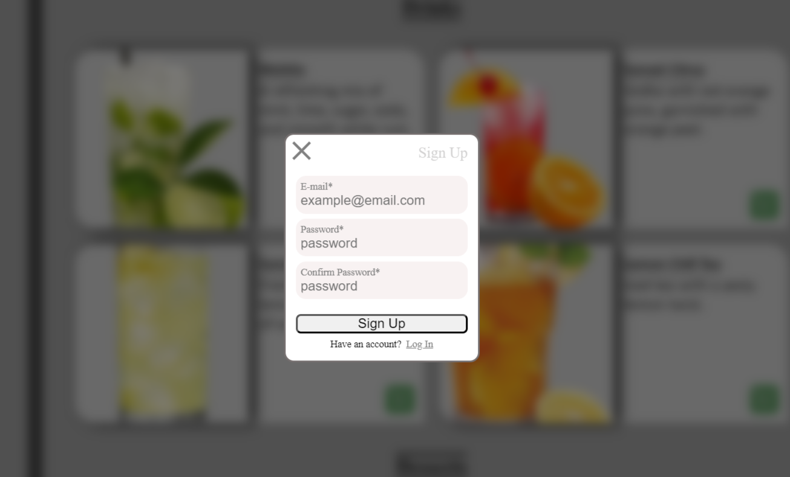
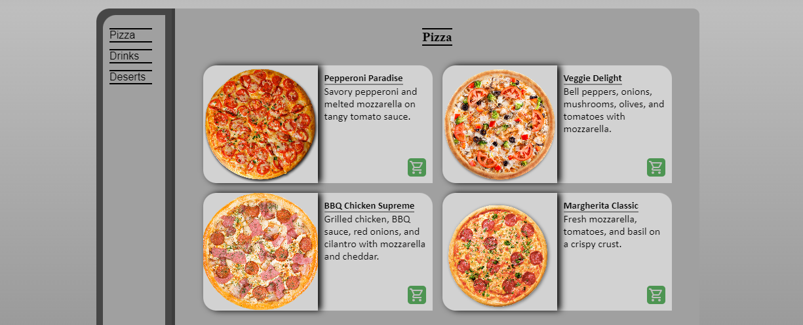
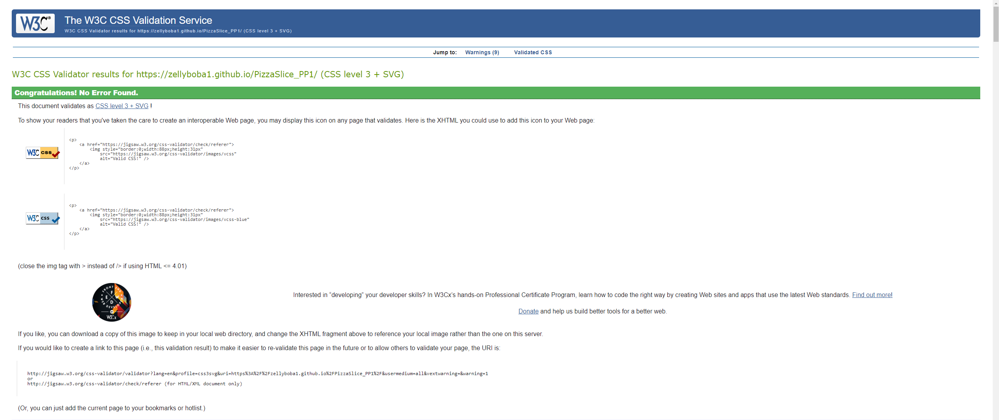

<h1 align="center">PizzaSlice</h1>
Welcome to PizzaSlice, your go-to online destination for ordering the most delicious and fresh pizzas! At PizzaSlice, we believe that every pizza should be a masterpiece, crafted with the finest ingredients and baked to perfection.
Whether you're a fan of classic Margherita, craving a spicy Pepperoni, or looking to try one of our gourmet specialties, PizzaSlice has something to satisfy every pizza lover's palate. Our commitment to quality and customer satisfaction ensures that you'll always enjoy a mouth-watering meal, delivered hot and fresh to your doorstep.

The PizzaSlice site is live, please [CLICK HERE](https://zellyboba1.github.io/PizzaSlice_PP1/) to check the website.

## Tabel of Contents
- [Tabel of Contents](#tabel-of-contents)
- [UX](#ux)
  - [Site Purpose](#site-purpose)
  - [Site Goal](#site-goal)
  - [Audience](#audience)
  - [Communication](#communication)
  - [Current User Goals](#current-user-goals)
  - [New User Goals](#new-user-goals)
- [Design](#design)
  - [Colour Scheme](#colour-scheme)
  - [Typography](#typography)
  - [Imagery](#imagery)
- [Features](#features)
  - [Existing Features](#existing-features)
    - [Navigation bar](#navigation-bar)
    - [Landing Section](#landing-section)
    - [About Us Section](#about-us-section)
    - [Menu Section](#menu-section)
    - [Memory Wall](#memory-wall)
    - [Contact Page](#contact-page)
    - [Footer and Social Links](#footer-and-social-links)
  - [Future Features](#future-features)
- [Testing](#testing)
  - [Validator Testing](#validator-testing)
  - [Unfixed Bugs](#unfixed-bugs)
- [Technologies Used](#technologies-used)
  - [Main Languages Used](#main-languages-used)
  - [Frameworks, Libraries \& Programs Used](#frameworks-libraries--programs-used)
- [Deployment](#deployment)
  - [How to deploy](#how-to-deploy)
  - [How to clone](#how-to-clone)
- [Credits](#credits)
  - [Content](#content)
  - [Media](#media)
  - [Acknowledgements](#acknowledgements)

## UX

### Site Purpose
The purpose of PizzaSlice is to provide an easy-to-use platform for pizza enthusiasts to explore and order their favorite pizzas online.

### Site Goal
The goal of PizzaSlice is to become the premier online destination for pizza lovers, offering an exceptional ordering experience that combines convenience, quality, and variety.

### Audience
PizzaSlice welcomes all pizza lovers. Families looking for easy, tasty meals for everyone will find our menu perfect. Busy professionals can rely on us for quick, tasty meals. College students will love our affordable, delicious options for study breaks or late nights.

### Communication
Simpe animated design to provide all the information that user will need.

### Current User Goals
- Make an order and have a great day

### New User Goals
- Easy navigation, understandable for new users
- Provide and update all the information with up-to-date 

## Design

### Colour Scheme
The colour palette was created by [Coolors](https://coolors.co) with five colors from black to white, the main idea is to make simple pallete without toxic colors, background was created with linear-gradient, which starts with white in the top and ends with black in the bottom, where you can find black footer with white social links, which makes it easier to see.

### Typography
"Open Sans" "Arial" "Sans-serif" and "Monospace" was picked, these fonts looks good and simple and supported by most browsers

### Imagery
All the images on the website, that I used was found on the Pinterest

## Features

### Existing Features
#### Navigation bar
Simple navigation bar with nanigation links which are using "monospace" font, and becomes underlined on hover

#### Login Pop Up
Simple login pop up, that appears in the middle of the screen when you press login button in the navbar,
it has blury dark overlay, which makes pop up container easier to focus on, and when you click on overlay it closes the login container

If you dont have an account and press the button it activates transition and signup container appears instead of login container

#### Landing Section
It describes theme of the website, and it tells users what they can find on this website

#### About Us Section
It tells user about the restaurant in general

#### Menu Section
Simple menu which includes sidebar, main content and custom scrollbar, where user can find all the products which he can order

You can also hover on item container and it will change its appearence

#### Memory Wall
The last one section, where you can find restaurant-related images and when you hover on them, you can read comments left by other users

#### Footer and Social Links
The Footer has only social links due to lack of content, divided from the gallery section with border above it, has 3 icons with external links, which opens in a new tab

### Future Features
- User account where user can find discount coupons for pizza
- Make a responsive cart, which will make order process easier
- Make descriptions for every item with information about nutrition and callories 

## Testing
  - Tested all links, which looks smooth and works properly
  - Tested the animation for pop up menu
  - Teste login form and verified that you cannot submit it without all the required fields completed
  - The website pages tested and they are fully responsive with all screen sizes.
  - Tested gallery animation

### Validator Testing
- HTML (By using [W3C validator](https://validator.w3.org/))

  -  Result for index.html

     
  
   

- CSS (By using [Jigsaw validator](https://jigsaw.w3.org/css-validator/))

  - Result for style.css

     
  

### Unfixed Bugs

## Technologies Used
### Main Languages Used
- HTML5
- CSS3

### Frameworks, Libraries & Programs Used
- Google Fonts - "Open Sans" "Arial" "Sans-serif" and "Monospace"
- VS-Code - simple programing enviroment
- GitHub - cloud service to store reposiory
- boxicons.com - all my social icons I took from this site

## Deployment
### How to deploy
- The site was deployed to GitHub pages. The steps to deploy are as follows:
- In the GitHub repository, navigate to the Settings tab
- From the source section drop-down menu, select the main Branch
- The live link can be found here - [PizzaSlice](https://zellyboba1.github.io/PizzaSlice_PP1/)

 ### How to clone
- Go to the following repository on GitHub: https://github.com/ZeLLyBOBA1/PizzaSlice_PP1
- At the top right of the screen, click the 'Code' button, and then click 'HTTPs'
- Copy the link in this field
- Open VS-code, creat new project folder, open the terminal
- On the terminal type "git clone", then paste the copied url and press 'Enter'
- The clone process should now begin

## Credits

### Content

- [W3Schools](https://www.w3schools.com/css/css3_mediaqueries.asp) - This website helped me to remember html and css structure, it was difficult to remember everything, and in the end of the project I was using this site less and less than in the begining 

- [YouTube](https://www.youtube.com/) - The most popular website with tons of educational videos, that helped me allot in this project, and will help in my future projects, there I found videos like "How to make your website responsive" and "Hamburger menu"

### Media
- Images on my website was taken from [Pinterest](https://www.pinterest.co.uk/)

### Acknowledgements

- I would like to say thank you to my mentor Martina and my facilitator Marko which helped me allot through the project